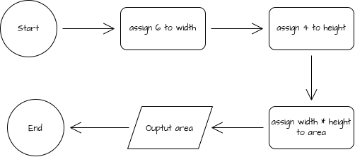

# Debugging Warm-Up 02

This program declares two variables as width and height, then calculates the area of those variables, printing the result.

## Flow Chart




## Pseudocode

```
FUNCTION main()
    DECLARE width : INTEGER
    DECLARE height : INTEGER
    DECLARE area : INTEGER

    width <-- 6
    height <-- 4
    area <-- width * height

    OUTPUT "Area: ", area
ENDFUNCTION
```
